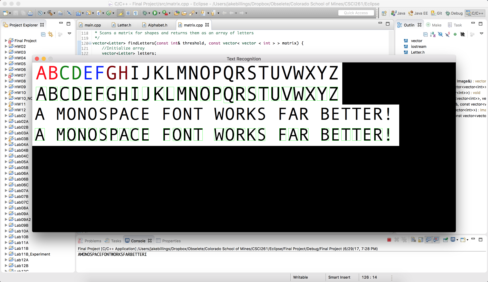

# research-ocr

Originally completed as a final project for CSCI261 via correspondence at Colorado School of Mines, this repository contains a C++ implementation of a simple OCR algorithm based on matrix comparison.

The algorithm works by converting color images to grayscale then comparing scaled matricies of detected letters to the known, scaled, grayscale matricies of each letter. Letters are detected using a simple edge detecting algorithm. This presents issues when using non-monospace fonts. Letters that touch each other are considered to be the same letter. This is a known issue with this particular letter detection algorithm.

### Other Projects ###
Checkout my other projects at [http://www.jakebillings.com](http://www.jakebillings.com) or contact me via [LinkedIn](https://www.linkedin.com/in/jake-billings/).